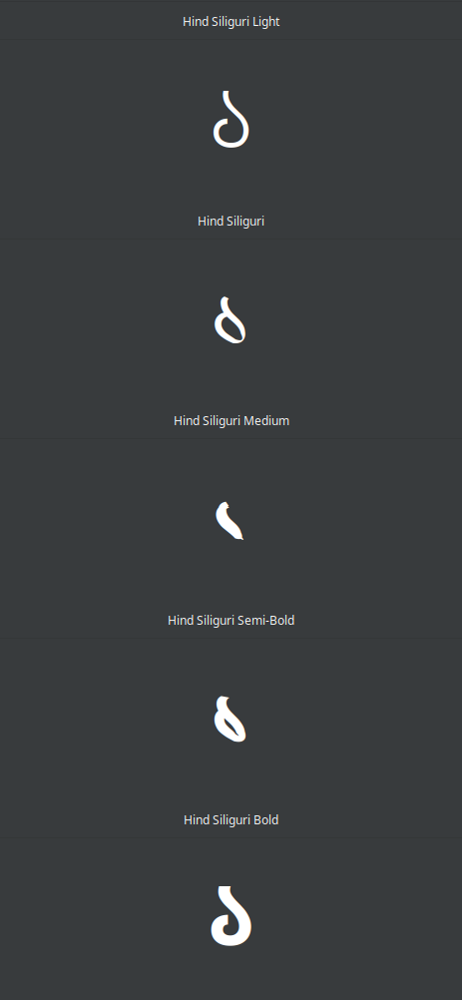
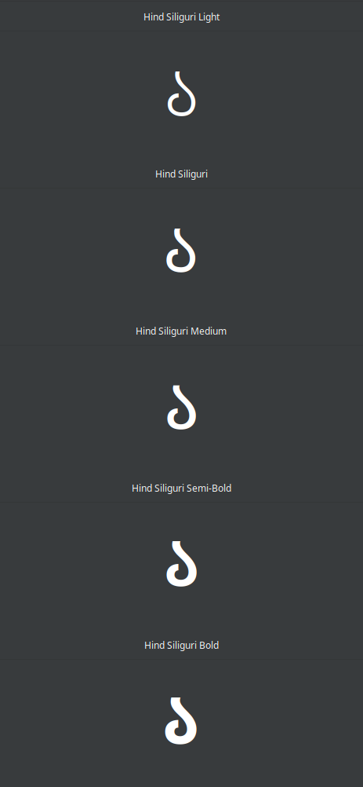

The [Hind Siliguri](https://fonts.google.com/specimen/Hind+Siliguri) typeface contains malformed glyphs for Bengali Digit One "১" in its regular, medium, and semi-bold weights.
I've fixed these for my personal use and decided to share here until original sources and distributions are updated.

| original glyphs                           | fixed glyphs                        |
|:-----------------------------------------:|:-----------------------------------:|
|  |  |

#### Note on sources

Original source is here: https://github.com/itfoundry/hind-siliguri.

The build instructions in ITF's repo seem outdated, so I've edited their published TTF files in fontforge, creating the SFD and TTF files available in this repository.
